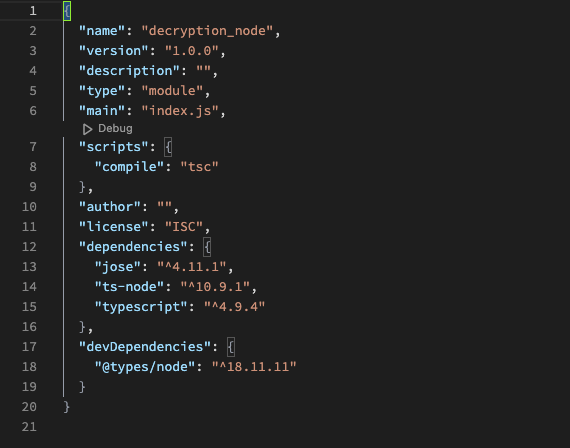
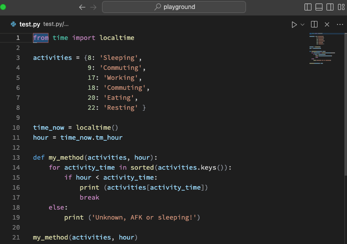
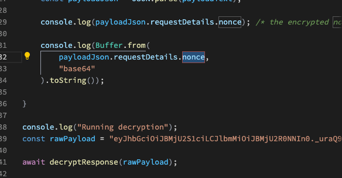
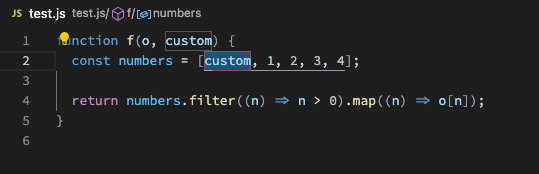
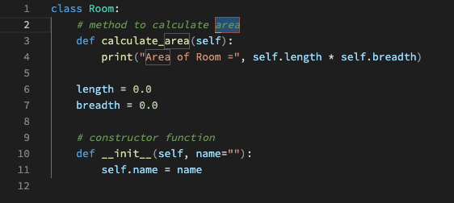

# CodeFlea

## Quick reference

1. To enter **Flea** mode, press `,.`
2. To enter **insert** mode `a`, `p`, `,`, `/` or `c` to insert at the end, beginning, current position, midpoint or delete the current selection and insert in its place
3. Press `↑`, `↓`, `←`, `→` or `u`, `e`, `n`, `i` to move to the neighbouring line, word, inter-word or block respectively

See more commands below in [Default keybindings](#default-keybindings).

## Summary

CodeFlea is a language-agnostic extension for VS Code that gives you commands to easily and intuitively move the cursor/selection and make edits within a code file, without using the mouse. It takes inspiration from editors such as Vim and Helix, but it works quite differently and is not an emulator of either editor.

## Why is this extension necessary?

VS Code has excellent code navigation abilities for jumping to a particular file or member, but it doesn't really have much functionality for moving around within a file; especially in more niche languages that don't have a lot of editor support, such as V, F# or Haskell.

CodeFlea addresses this by giving simple, intuitive commands for moving the cursor around in a way that's applicable to any language, even written prose or Markdown! It accomplishes this by identifying and manipulating text objects such as words, lines and blocks in the file based on usage of indentation, whitespace and operators.

# Basic operation

CodeFlea is a modal extension (such as Vim or Helix), meaning that pressing a key will not enter text unless the editor is in **insert** mode.

There are three modes in CodeFlea:

-   **Flea** mode: the default mode. In this mode, the editor is in a state where it is ready to accept commands to move the cursor around.
-   **Insert** mode: in this mode the editor will accept text input and keyboard shortcuts as normal for VS Code.
-   **Extend** mode: this is the same as **Flea** mode, except that each selection will be extended when a movement is made.

## Changing modes

The default mode when opening a new file is **Flea** mode. See the section on [keyboard shortcuts](#default-keybindings) for how to enter **Insert** mode.

To return to **Flea** mode, press `,` then `.` in (very) quick succession.

## Subjects and objects

CodeFlea operates on the basis of _text objects_, based on the currently selected _subject_.

> The difference between a subject and an object is similar to the difference between a _class_ and an _object_ in object-oriented programming. A subject is a type of object, and an object is an instance of a subject. For example, when the selected _subject_ is _word_, the _objects_ are all the individual words in the file.

The available subjects are:

-   [Lines](#lines)
-   [Words](#words)
-   [Inter-words](#inter-words)
-   [Subwords](#subwords)
-   [Blocks](#blocks)

Commands are available to:

-   move the selection to neighbouring objects
-   extend the selection to neighbouring objects
-   swap neighbouring objects
-   search for a particular object based on its first character
-   jump to any visible object

The editor will draw a border around the current selection(s) with a colour that corresponds to the current subject.

| Subject | Colour                                                          | Border |
| ------- | --------------------------------------------------------------- | ------ |
| Line    |  | Solid  |
| Word    |  | Solid  |
| Inter   |  | Dotted |
| Subword |  | Solid  |
| Block   |  | Solid  |

# Subjects in depth

## Lines

Perhaps the simplest text subject to understand is a line. A line is defined as a sequence of characters that ends with a newline sequence.

## Words

The definition of a _word_ in CodeFlea is left up to VS Code. This means that the definition of a word is potentially influenced by the language mode of the file.

## Inter-words

An _inter-word_ is the sequence of characters that separates two words. This includes whitespace, operators etc.

## Subwords

A _subword_ is much like a word, but camel-case / snake-case words are split into their constituent parts. For example, the word `camelCase` would be split into `camel` and `Case`.

## Blocks

The beginning of a block of code is identified by comparing it to the previous line. A block start is defined as any of the following:

-   the first line of the file
-   a line more indented than the previous line
-   the first significant line after a stop-line†

> † A "stop-line" is a line that does not contain any alphanumeric characters, such as a blank line or a brace on its own

Example 1: In the following example Typescript the beginning of each block has been illustrated.

```
    ┌─  export function* iterLines(
    ├───── document: vscode.TextDocument,
    │      currentLineNumber: number,
    │      direction: Direction,
    │      skipCurrent = true
    │      ) {
    ├───── const advance = fromDirection(direction);
    │
    ├───── if (skipCurrent) currentLineNumber = advance(currentLineNumber);
    │
    ├───── while (withinBounds()) {
    ├────────── yield document.lineAt(currentLineNumber);
    │           currentLineNumber = advance(currentLineNumber);
    │       }
    │
    ├────── function withinBounds() {
    └────────── return currentLineNumber >= 0 && currentLineNumber < document.lineCount;
            }
        }
```

A block is defined as a sequence of lines that are either:

-   continuously joined to the block start (i.e. they are not separated by blank lines)
-   indented further the block start

Due to the fact that CodeFlea is entirely based on whitespace and operators it should just work in any programming language, whether it's Javascript, F#, Haskell, V, Python or others.

Example 2, Python:

```
┌── import unittest
│
├── def median(pool):
├────── copy = sorted(pool)
│       size = len(copy)
│
├────── if size % 2 == 1:
├────────── return copy[int((size - 1) / 2)]
├────── else:
├────────── return (copy[int(size/2 - 1)] + copy[int(size/2)]) / 2
│
├── class TestMedian(unittest.TestCase):
├────── def testMedian(self):
├────────── self.assertEqual(median([2, 9, 9, 7, 9, 2, 4, 5, 8]), 7)
│
├── if __name__ == '__main__':
└────── unittest.main()
```

Example 3, Haskell:

```
┌── tuple = (1, 2)
│
├── tuple3 = (1, 2, 3)
│
├── first (a, _, _) = a
│   second (_, b, _) = b
│   third (_, _, c) = c
│
├── main = do
├────── print tuple
│       print $ fst tuple
│       print $ snd tuple
│
└────── print tuple3
        print $ first tuple3
        print $ second tuple3
        print $ third tuple3

```

# Movements

## Moving

The basic movement commands are laid out on the QWERTY keyboard in the same way as a normal arrow cluster:

```
      ┌───┐                   ┌───┐
      │ I │                   │ ↑ │
      └───┘                   └───┘
┌───┐ ┌───┐ ┌───┐   =   ┌───┐ ┌───┐ ┌───┐
│ J │ │ K │ │ L │       │ ← │ │ ↓ │ │ → │
└───┘ └───┘ └───┘       └───┘ └───┘ └───┘
```

## Searching

By pressing `s` you will be prompted for the first character of the desired object. Once you have entered the first character, the selection will be moved to the first object that begins with that character. To search backwards the process is the same; just press `f` instead.

## Jumping

Pressing `t` will open the jump interface, allowing you to jump to any visible object. The jump interface is similar to EasyMotion in Vim, where each visible object will be given a _jump code_, and pressing the given key in the jump code will move the selection to that text object.



Words work a little differently; due to the sheer number of words that will be visible at any one time in the editor, jumping to a word is a two-step process. First, you will be asked for the first character of the desired word, and only once that character is entered will you be shown the jump codes for all the words that begin with that character.



# Editing

## Deleting

Press `d` to delete the current text object(s). This will remove the current selection(s) from the text document, as well as clean up any separating characters that are left behind.



## Moving / swapping

Text objects can be swapped with their neighbouring objects, meaning you can move text objects around without having to delete and re-insert them.

In the case of words, this allows you to reorder arguments to a function or items in a list, for example:



By first changing the _subject_ to _Block_, we can reorder the methods of a class:



# Default keybindings

## Changing modes

| Default keybinding | Command ID                            | Description                                                  |
| ------------------ | ------------------------------------- | ------------------------------------------------------------ |
| `a`                | `codeFlea.changeToInsertModeAppend`   | Insert at the end of the current selection                   |
| `p`                | `codeFlea.changeToInsertModePrepend`  | Insert at the beginning of the current selection             |
| `,`                | `codeFlea.changeToInsertMode`         | Insert at the current position, leaving the selection intact |
| `/`                | `codeFlea.changeToInsertModeMidPoint` | Insert at the midpoint of the current selection              |
| `/`                | `codeFlea.changeToInsertModeSurround` | Insert at the midpoint of the current selection              |
| `c`                | `codeFlea.changeToInsertModeAppend`   | Delete the current selection and insert in its place         |

| Default keybinding          | Command ID | Description           |
| --------------------------- | ---------- | --------------------- |
| `, .` (when in insert mode) | ``         | Change to insert mode |

| Default keybinding | Command ID                    | Description                 |
| ------------------ | ----------------------------- | --------------------------- |
| `v`                | `codeFlea.changeToExtendMode` | Start or stop _extend_ mode |

## Changing subjects

| Default keybinding | Name                              | Description                              |
| ------------------ | --------------------------------- | ---------------------------------------- |
| `w`                | `codeFlea.changeToWordSubject`    | Change to _word_ / _inter-word_ subject† |
| `q`                | `codeFlea.changeToSubwordSubject` | Change to _subword_ subject              |
| `x`                | `codeFlea.changeToLineSubject`    | Change to _word_ subject                 |
| `b`                | `codeFlea.changeToBlockSubject`   | Change to _word_ subject                 |

> † This key binding will change to _word_ subject unless you're already in it, in which case it will cycle between _inter-word_ and _word_.

## Movements

| Default keybinding | Command ID                         | Description                                           |
| ------------------ | ---------------------------------- | ----------------------------------------------------- |
| `↑` / `u`          | `codeFlea.nextSubjectUp`           | Move to the next object above                         |
| `↓` / `e`          | `codeFlea.nextSubjectDown`         | Move to the next object below                         |
| `←` / `n`          | `codeFlea.nextSubjectLeft`         | Move to the next object to the left                   |
| `→` / `i`          | `codeFlea.nextSubjectRight`        | Move to the next object to the right                  |
| `;`                |                                    | Go back                                               |
| `shift + ;`        |                                    | Go forwards                                           |
| `s`                | `codeFlea.search`                  | Forward search of objects by their first character    |
| `f`                | `codeFlea.searchBackwards`         | Backward search of objects by their first character   |
| `t`                | `codeFlea.jump`                    | Jump to a particular object (see [Jumping](#jumping)) |
| `l`                | `codeFlea.goToFirstSubjectInScope` | Move to the first object in current scope             |
| `y`                | `codeFlea.goToLastSubjectInScope`  | Move to the last object in current scope              |
| `j`                | `codeFlea.goToPrevOccurrence`      | Move to the next occurrence of the current object     |
| `h`                | `codeFlea.goToNextOccurrence`      | Move to the previous occurrence of the current object |
| `'`                | `codeFlea.jump`                    | Begin a _fleajump_                                    |

## Modifying selections

| Default keybinding    | Command ID                        | Description                                                          |
| --------------------- | --------------------------------- | -------------------------------------------------------------------- |
| `shift + ↑`           | `codeFlea.addSubjectUp`           | Add the object above as a new selection                              |
| `shift + ↓`           | `codeFlea.addSubjectDown`         | Add the object below as a new selection                              |
| `shift + ←`           | `codeFlea.addSubjectLeft`         | Add the object to the left as a new selection                        |
| `shift + →`           | `codeFlea.addSubjectRight`        | Add the object to the right as a new selection                       |
| `z` / `shift + enter` | `cursorUndo`                      | Undo the last movement / selection change                            |
| `shift + z`           | `cursorRedo`                      | Redo the last movement / selection change                            |
| `shift + j`           | `codeFlea.extendToPrevOccurrence` | Add the next occurrence of the current object as a new selection     |
| `shift + h`           | `codeFlea.extendToNextOccurrence` | Add the previous occurrence of the current object as a new selection |

## Editing

| Default keybinding | Command ID                  | Description                                                    |
| ------------------ | --------------------------- | -------------------------------------------------------------- |
| `d`                | `codeFlea.deleteSubject`    | Delete the current object (also cleans up separating text)     |
| `shift + d`        | `codeFlea.duplicateSubject` | Duplicate the current object (also duplicates separating text) |
| `o`                | `codeFlea.newLineBelow`     | Open a new line below and change to **insert** mode            |
| `shift + o`        | `codeFlea.newLineAbove`     | Open a new line above and change to **insert** mode            |
| `m`                | `codeFlea.openModifyMenu`   | Open the modify menu                                           |
| \*`ctrl/alt + ↑`   | `codeFlea.swapSubjectUp`    | Move the current object up                                     |
| \*`ctrl/alt + ↓`   | `codeFlea.swapSubjectDown`  | Move the current object down                                   |
| \*`ctrl/alt + ←`   | `codeFlea.swapSubjectLeft`  | Move the current object left                                   |
| \*`ctrl/alt + →`   | `codeFlea.swapSubjectRight` | Move the current object right                                  |
| `enter`            | `codeFlea.repeatCommand`    | Repeat the last movement / command                             |

\* `ctrl` on Mac, `alt` on Windows

## General

| Default keybinding | Command ID               | Description           |
| ------------------ | ------------------------ | --------------------- |
| `space`            | `codeFlea.openSpaceMenu` | Open the _space_ menu |
| `g`                | `codeFlea.openGoToMenu`  | Open the _go to_ menu |

# Tips and tricks

-   The _split selection_ command is particularly useful for the _inter-word_ subject
-   CodeFlea is compatible with the mouse. You can
    -   click on a text object to select it
    -   drag to select (as normal) which will change the editor to **insert** mode
-   After conducting a _quick search_, you can press `enter` to repeat the search--moving the selection to the next search result

# Development

If you'd like to contribute

## Building and running

-   Run `npm install` in your terminal to install dependencies
-   In VS Code run the `Run Extension` target in the Debug View.

## Packaging

If you would like to make changes to the extension and then install install your dev version in your local VS Code instance, run `vsce package` in your terminal. This will create a `.vsix` file which you can install in VS Code.
